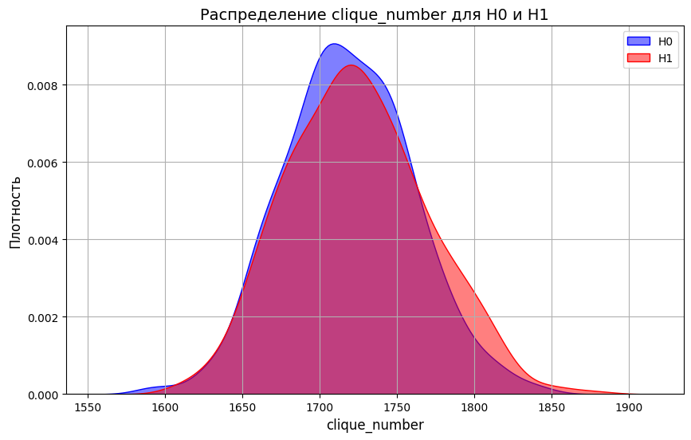

# dm-random-graphs# DM Random Graphs

[](https://github.com/Tsanami/dm-random-graphs/actions)
[](https://opensource.org/licenses/MIT)
[](https://www.python.org/)

Проект для статистического анализа случайных графов и проверки гипотез согласия. Реализует сравнение характеристик KNN-графов и дистанционных графов для распределений χ² и χ.

---
## Команда
- **Гареев Равиль**: 
  - Эксперименты с распределениями χ² (хи-квадрат) и χ (хи)
  

- **Хамаганов Ильдар**:
  - Эксперименты с распределениями Stable(α) и Normal(0,σ)
## Особенности
- **Генерация данных** из распределений:
  - χ² (хи-квадрат)
  - χ (хи)
  - Stable(α)
  - Normal(0,σ)
- **Построение графов**:
  - KNN-графы (`k` ближайших соседей)
  - Дистанционные графы (пороговое расстояние `d`)
- **Анализ характеристик**:
  - Степени вершин, число треугольников
  - Кликовое число, хроматическое число
- **Монте-Карло симуляции** для оценки мощности критериев
- **LaTeX-отчёты** с визуализацией результатов

---

## Пример использования
### 1. Генерация данных
```python
from src.distribution_generators import generate_chi2, generate_chi

# Гипотеза H0: χ²-распределение (nu=5, n=500)
data_h0 = generate_chi2(nu=5, n=500)

# Гипотеза H1: χ-распределение (nu=5, n=500)
data_h1 = generate_chi(nu=5, n=500)

```
### 2. Построение графа
```python
from src.build_graph import build_knn_graph, build_distance_graph

# KNN-граф (k=5)
knn_graph = build_knn_graph(data_h0, k=5)

# Дистанционный граф (d=1.0)
dist_graph = build_distance_graph(data_h1, d=1.0)
```

### 3. Анализ характеристик
```python
from src.graph_analyzer import GraphAnalyzer

analyzer = GraphAnalyzer(dist_graph)
print("Макс. степень:", analyzer.max_degree())
print("Кликовое число:", analyzer.clique_number(d=1.0))
print("Хроматическое число:", analyzer.chromatic_number())
```

### 4. Визуализация
```python
from src.visualization import plot_distributions

plot_distributions(
    h0_stats=h0_results, 
    h1_stats=h1_results,
    metric_name="clique_number",
    save_path="report/graph_comparison.png"
)
```
Пример графика распределения характеристики для χ² и χ:


## Установка
## Инструкция
1. Клонируйте репозиторий:
```bash
git clone https://github.com/Tsanami/dm-random-graphs.git
cd dm-random-graphs
```
2. Установите зависимости:
```bash
pip install -r requirements.txt
```
## CI/CD
### Конфигурация GitHub Actions включает:
 - Линтинг: flake8
 - Форматирование: black
 - Тесты: pytest

## Структура проекта
```text
├── notebooks/ # Эксперименты и анализ
├── src/                             # Исходный код
│   ├── __init__.py                  # Пакет Python
│   ├── build_graph.py               # Построение графов
│   ├── graph_analyzer.py            # Анализ характеристик
│   ├── monte_carlo.py               # Монте‑Карло симуляции
│   ├── distribution_generators.py   # Генераторы распределений
│   ├── hypothesis_testing.py        # Тесты гипотез (критические области, мощность)
│   └── visualization.py             # Генерация графиков
├── report/                          # Отчёты LaTeX
│   ├── PART_I.tex                   # Полный отчёт 1 часть
│   └── PART_I.pdf                   # Отчет pdf 1 часть
├── tests/                           # Юнит-тесты и интеграционные тесты
├── .github/workflows/               # CI‑конфигурация
├── requirements.txt                 # Зависимости
└── LICENSE                          # Лицензия MIT
```


## Лицензия
Проект распространяется под лицензией MIT.
Разрешено: использование, модификация, распространение. Обязательно: указание авторства.
